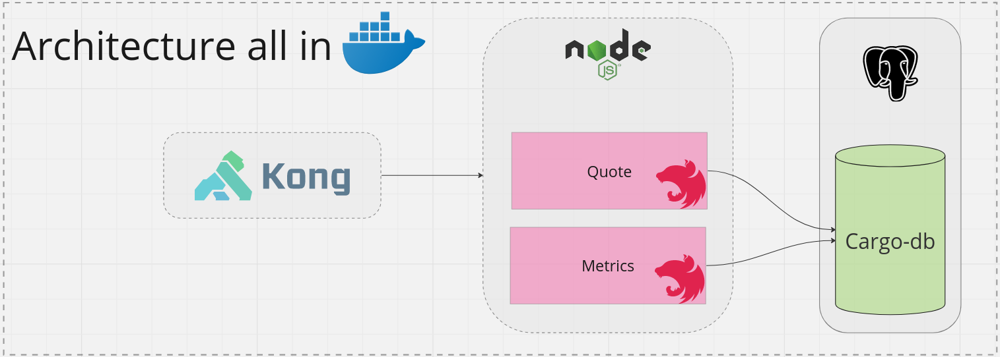

# Fast Cargo

Solução para realizar cotações e retornar métricas dos resultados.

<div align="center">
  <p align="center">
  <a href="https://www.linkedin.com/in/lucasfdcampos/">
    
  </a>
  
  
  <a href="https://github.com/lucasfdcampos/fast-cargo/commits/master">
    
  </a>
  </p>
</div>

## Index
- [Solução](#solução)
- [Arquitetura](#arquitetura)
  * [Quote](#quote)
  * [Metrics](#metrics)
- [Executando](#executando)
  * [Makefile](#makefile)
  * [Manualmente](#manualmente)
  * [Utilizando as APIs](#utilizando-as-apis)
- [Testes](#testes)
- [Tecnologias](#tecnologias)
- [Escolhas técnicas](#escolhas-técnicas)
- [Swagger](#swagger)
- [Anotações](#anotações)

## Solução
Esta solução consiste em dois microsserviços onde é possível realizar as seguintes operações:

- _Quotes_
  - Requisitar cotações
- _Metrics_
  - Listar métricas das cotações salvas

## Arquitetura



Conforme a figura acima, toda estrutura está em containers _Docker_ onde temos dois microsserviços: **_Quote_** e **_Metrics_**. Ambos serviços se conectam ao banco de dados PostgreSQL para persistência e fonte de dados. 

Ambos serviços estão conectados ao Kong API-Gateway.

### Quote

Esse serviço é responsável por realizar cotações através da URL de integração e 
persistir os dados no banco de dados.

### Metrics

Esse serviço é responsável por processar as cotações e retornar as métricas.

## Executando

### Makefile

O comando abaixo irá subir todos os serviços _Docker_ necessários:

```bash
make up-all
```

### Manualmente

Caso prefira subir o ambiente sem o _Makefile_ acima:

```bash
docker network create cargo-net
docker-compose up -d
```

### Utilizando as APIs

Pode ser importado as _collections_ do _Insomnia_ (``made by Kong``) ou utilizar os comandos diretamente no terminal (via curl) - para isso é necessário ter o curl instalado.

[](https://insomnia.rest/run/?label=Fast-Cargo&uri=https%3A%2F%2Fraw.githubusercontent.com%2Flucasfdcampos%2Ffast-cargo%2Fmaster%2Fcargo_insomnia.json)


#### Requisitando cotações

```bash
curl -X POST "http://localhost:8000/quote" \
  -H "Authorization: Bearer <token>" \
  -H "Content-Type: application/json" \
  -d '{
    "recipient": {
      "address": {
        "zipcode": "01311000"
      }
    },
    "volumes": [
      {
        "category": 7,
        "amount": 1,
        "unitary_weight": 5,
        "price": 349,
        "sku": "abc-teste-123",
        "height": 0.2,
        "width": 0.2,
        "length": 0.2
      },
      {
        "category": 7,
        "amount": 2,
        "unitary_weight": 4,
        "price": 556,
        "sku": "abc-teste-527",
        "height": 0.4,
        "width": 0.6,
        "length": 0.15
      }
    ]
  }'

```

#### Listando métricas

```bash
curl -X GET "http://localhost:8000/metrics?last_quotes=?" \
  -H "Authorization: Bearer <token>"

```


## Testes

#### _Quote_

```bash
make test-quote
```

#### _Metrics_

```bash
make test-metrics
```

## Tecnologias
- Docker
- NestJS
- PostgreSQL
- Kong API-Gateway
- TypeORM

## Escolhas técnicas

#### Clean code
Procurei ao máximo deixar as classes e métodos com atribuições únicas e com escopo reduzido, com apenas uma única funcionalidade e objetivo. O NestJs contém um _pattern_  que contribui para esta premissa.

#### Microservice
Arquitetura escolhida pela escabilidade, modularidade, elasticidade, tolerância a falhas, testabilidade e confiabilidade.

#### Kong Api-Gateway
Uma _Api-Gateway_ entrega muitas vantagens, neste pequeno projeto serve para direcionar as _requests_ para o _microservice_ adequado, mas de uma maneira geral, contém diversas vantagens, como: suporte a _plugins_, balanceamento de carga e estabilidade, _rate limiting_ e _throttling_, suporte a vários protocolos e escalabidade.


#### Event-Driven
Trabalhar com _microservices_ pode ser muito complexo dependendo do domínio da aplicação. Um dos grandes problemas desta arquitetura são as chamadas síncronas entre serviços, que podem gerar lentidão no sistema como um todo ou falharem devido a problemas de rede. _Event-Driven_ é descrito por Mark Richards e Neal Ford em [Fundamentals of Software Architecture: An Engineering Approach](https://www.goodreads.com/book/show/44144493-fundamentals-of-software-architecture) como uma `arquitetura`. Nesta arquitetura, cada _transaction_ gera um evento e este será usado por outra ação que também irá gerar um evento e assim por diante.

Devido a esta característica, _microservices_ "casam" bem como uma arquitetura baseada em eventos, pois os erros de rede são drasticamente diminuídos e tudo acontece de forma assíncrona.


## Swagger

A documentação _Swagger_ está divida entre os microserviços (para acessá-las os serviços precisam estar ``up``):

<a href="http://localhost:3000/swagger" target="_blank">Swagger Quote</a>
<br />
<a href="http://localhost:3010/swagger" target="_blank">Swagger Metrics</a>


## Anotações

Gosto de utilizar o [Notion](https://www.notion.so/) para fazer anotações e _todo lists_ enquanto desenvolvo, então disponibilizarei aqui as notas do projeto, com idéias, prioridades do fluxo de trabalho e _features_ que eu gostaria de ter desenvolvido:

[notes](https://amplified-subway-859.notion.site/FastCargo-4781919d5ca74c228cba9e39c26f97f8?pvs=4)

---
<p align="auto">
  <a href="https://www.linkedin.com/in/lucasfdcampos/">
    
  </a>
</p>
